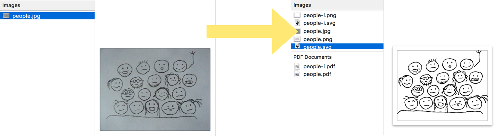

# cartoonist

Tool to help lazy cartoonists to convert photo of a hand drawing into an SVG/PDF vector file.



## Installation

```shell
$ ./install.sh
```

- Installs system dependencies.
- Installs necessary [Fred's ImageMagick Scripts](http://www.fmwconcepts.com/imagemagick/) into the `./lib` directory.

> **Note:** Only [Homebrew](http://brew.sh/), [openSUSE](https://www.opensuse.org/) and [Arch Linux](https://www.archlinux.org/) are supported as of now. Feel free to contribute installation of dependencies with your favorite package manager, e.g. `apt-get`.

## Usage

```shell
$ ./cartoonist.sh photo-of-my-drawing.jpg
```

### Produces

- `photo-of-my-drawing.png` - PNG, black/transparent
- `photo-of-my-drawing-i.png` - PNG, white/transparent
- `photo-of-my-drawing.pdf` - PDF, black/transparent
- `photo-of-my-drawing-i.pdf` - PDF, white/transparent
- `photo-of-my-drawing.svg` - SVG, black/transparent
- `photo-of-my-drawing-i.svg` - SVG, white/transparent

### Why?

- Black versions are useful for embedding the image on light backgrounds.
- White versions are useful for embedding the image on dark backgrounds.
- PDF versions can be imported to [Keynote](http://www.apple.com/mac/keynote/) as vector graphics.
- SVG versions are useful anywhere else as vector graphics.
- PNG versions are useful as ugly pixelated bitmaps when neither PDF and SVG versions can be used.

## Tests

I assembled a little test suite (or rather _verification-by-eye_ suite) to develop this script. Sample images are in the `test` directory. You can run the suite by executing `./test.sh`. It uses throwaway `./build` directory where it produces the results.

## License

The script is licensed under [MIT](./LICENSE). If you want to use it, please note that dependencies (especially Fred's ImageMagick Scripts) can have different licensing and you should respect it.

You can freely use the images inside of the `./test` directory to develop changes in the cartoonist, but you are not permitted to use them anywhere else unless permitted by me personally. `./test` is **NOT** licensed by MIT and is, for any other use than for debugging this script, a subject of my copyright.
